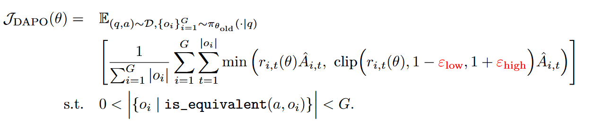
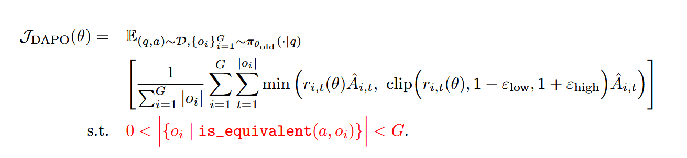
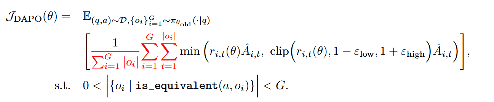
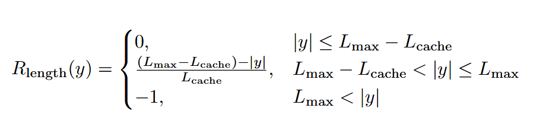

### 本仓库的DAPO算法是由[[om-ai-lab/VLM-R1: Solve Visual Understanding with Reinforced VLMs](https://github.com/om-ai-lab/VLM-R1/tree/main?tab=readme-ov-file)]中的GRPO算法改写得到

### 算法在vrl框架上实现，相比于原有代码主要修改如下部分：

- 添加`dapo_trainer.py`，构造`VLMDAPOTrainer`类，修改`VLMGRPOTrainer`类中的`compute_loss`等函数，添加`_get_train_sampler`、`get_sample_dataloader`等函数
- 修改`vlm_modules`中的`qwen_module.py`，增加`length_reward`函数
- 对vrl框架中的参数设置进行适配
- 修改主要集中在`compute_loss`函数，包括：
  - 删除KL散度
  - 删除refrence  model相关代码
  - 修改Loss的计算方式，改为全局样本计算
  - 构造独立的`sample_dataloader`，当数据不符合条件时重新sample数据
  - 注意重设随机种子，保证新样本与之前的不重复
- 实现了DAPO论文中提及的全部改进，即：

